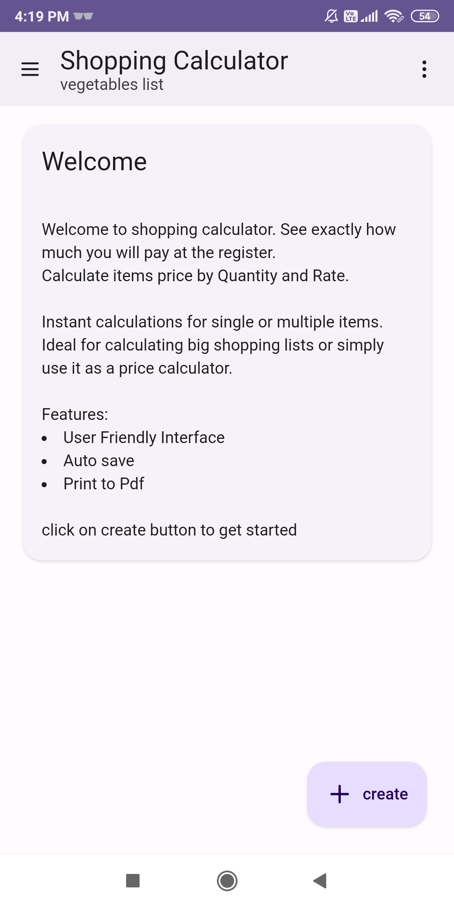

# Shopping Calculator

An Android App to keep track of your shopping items. Just add the product rate and quantity to calculate the final price.

Made with react js

## Download
Download Shopping calculator android app latest version:

<a href="https://github.com/iamvkr/shopping-calculator/raw/refs/heads/main/apk/Shopping-calculator.apk" target="_blank">

</a>

## Install Dependencies
To load development server use
```bash
npm install
```

## Preview
To load development server use
```bash
npm run dev
```

## Watch Video
<a href="https://youtu.be/gB5tcN8vVU8?si=bVEzIO2hoQIn40N9" target="_blank">

</a>